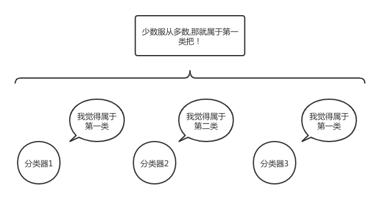
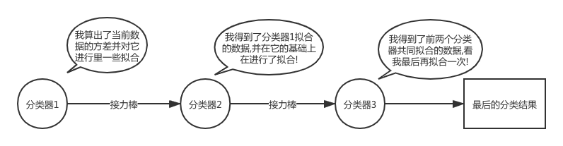

# 机器学习之集成模型

## 集成模型简介

在机器学习领域,对模型进行集成是一种十分好的提升整体模型性能的方法.常见的集成方法主要是Bagging和Boosting,Stacking等策略.接下来我们就具体介绍一下各种集成的策略及其对应的算法内容.

## Bagging

首先我们来了解一下bagging集成的策略.其实bagging模型的融合方法十分的简单.主要思路是创建多个弱分类器,对弱分类器分类出的结果进行投票,采用最后投票多的结果作为模型最后的预测结果.下面的图就极好的体现了bagging的思想下对样本进行决策:



bagging思想中最著名的模型就是随机森林.其每次通过从原本的数据集中随机抽样出一个随机数量和随机特征的样本子集,在这个样本子集上自由的生长出一颗决策树,迭代多次就得到了多棵类似的决策树.并根据这多棵决策树对最后的结果进行一次投票,从而得到一个更优秀的模型.

具体的实战代码如下,数据采用的是iris数据集,划分数据集并采用五折交叉验证的方式.注意到我们最后的结果采用每一折最后保留的结果,这也是一种集成的方法.既可以提高模型的泛化能力又防止了过拟合的出现.

```python
from sklearn.ensemble import RandomForestClassifier
import pandas as pd
from sklearn.metrics import accuracy_score
from sklearn.model_selection import train_test_split, KFold
from sklearn.preprocessing import LabelEncoder
import numpy as np

if __name__ == '__main__':
    iris = pd.read_csv("iris.csv", index_col=0)
    # 验证集合划分.
    data, labels = np.array(iris.iloc[:, :-1]), iris.iloc[:, -1]
    # 标签转为数字
    labelec = LabelEncoder()
    labels = labelec.fit_transform(labels)
    traindata, testdata, trainlabels, testlabels = train_test_split(data, labels, test_size=0.1)

    result = np.zeros((len(testlabels), 3))  # 提前设置一个维度为[15,3]的矩阵用于保留最后的预测结果.
    kfold = KFold(n_splits=5, shuffle=True, random_state=2020)
    model = RandomForestClassifier()
    for tra, val in kfold.split(traindata, trainlabels):
        model.fit(traindata[tra], trainlabels[tra])
        prediction = model.predict(traindata[val])

        # 计算该折模型下的正确率.
        print("Acc:{}".format(accuracy_score(prediction, trainlabels[val])))

        # 多折交叉运算保留每一折其中的一部分，也算一种集成的方式
        pre = model.predict_proba(testdata)  # 这里得到对应的概率值.
        result += pre / 5

    # 查找对应行下值的最大下标
    result = np.argmax(result, axis=1)
    print("Acc:{}".format(accuracy_score(result, testlabels)))
```

最后测试的结果比较好,基本上在0.99-1之间.

## Boosting

然后接着我们来讲另外一种Boosting的集成思路,该种方法的思路与bagging的截然不同,它更像是一种接力赛的方式.我们先看下图了解一下对应的模型的工作方式.



通过逐个分类器对当前数据进行一系列的拟合和修正最终可以得到一连串的并行的分类器链.那么再遭遇到新的数据,我们只要对当前的数据也通过这一个分类器链不就可以了嘛!

当然Boosting只是一种思路,具体的实现方法有很多,例如Adaboost通过one-error计算对应的样本的损失来修正数据的权重,而GBDT则采用对应的梯度提升的方法实现,XGBoost和LightGBM等也在GBDT上进行了优化.

在这里我们不细致地展开去讲所有算法对应的实现.只对当前比较火热的GBDT算法做一个介绍.

这个算法大致的训练过程如下.每次计算对应当前整个GBDT预测值和实际标签间的方差,计算对应的方差值.并取当前的方差值作为下一颗树木拟合的数据.咱们通过下面的图快速了解GDBT的运算过程.


这里假设我们有一个数据集,里面有A,B,C,D四个人,对这四个人我们渴望预测出他们的具体年龄.

那么GBDT算法首先根据他们购物的金额多少,分成了15岁(A,B)和25岁(C,D)两组,而实际上A是14岁,B是16岁,那么第一组计算得到的残差就是(-1,1).同样的得到第二组的残差为(-1,1).

好的那么我们第二组就接着对A,B,C,D四个人的年龄残差(-1,1,-1,1)进行拟合,那么第二颗树就分类得到两组,那么结合上图我们可以看到,两次分到的组的值相加,那么就刚好得到最后样本的残差为0,那么这个时候就停止在拟合.

同样的,我们在iris数据集合上试一试咱们的算法.

```python
import lightgbm
from sklearn.ensemble import RandomForestClassifier
import pandas as pd
from sklearn.metrics import accuracy_score
from sklearn.model_selection import train_test_split, KFold
from sklearn.preprocessing import LabelEncoder
import numpy as np
import warnings
warnings.filterwarnings('ignore')

if __name__ == '__main__':
    iris = pd.read_csv("iris.csv", index_col=0)
    # 验证集合划分.
    data, labels = np.array(iris.iloc[:, :-1]), iris.iloc[:, -1]
    # 标签转为数字
    labelec = LabelEncoder()
    labels = labelec.fit_transform(labels)
    traindata, testdata, trainlabels, testlabels = train_test_split(data, labels, test_size=0.1)

    result = np.zeros((len(testlabels), 3))  # 提前设置一个维度为[15,3]的矩阵用于保留最后的预测结果.
    kfold = KFold(n_splits=5, shuffle=True, random_state=2020)
    model = lightgbm.LGBMClassifier(
        max_depth=5,
        num_leaves=25,
        learning_rate=0.7,
        n_estimators=100,
        min_child_samples=80,
        colsample_bytree=1,
    )

    for tra, val in kfold.split(traindata, trainlabels):
        model.fit(traindata[tra], trainlabels[tra])
        prediction = model.predict(traindata[val])

        # 计算该折模型下的正确率.
        print("Acc:{}".format(accuracy_score(prediction, trainlabels[val])))

        # 多折交叉运算保留每一折其中的一部分，也算一种集成的方式
        pre = model.predict_proba(testdata)  # 这里得到对应的概率值.
        result += pre / 5

    # 查找对应行下值的最大下标
    result = np.argmax(result, axis=1)
    print("Acc:{}".format(accuracy_score(result, testlabels)))

```

Boosting算法的效果不如bagging算法来的好准确率偏低,有可能出现了过拟合的现象,待深入研究.

## Stacking

除了上述两种比较常见的集成学习的方法,其实还有一些在比赛中的常用的栈式的叠加的模型集成的方法,这种方法目前没有比较好的成型的模型,也没有适合的生成套路.整体来说是比赛上分比较玄学的一种方式.

## 回顾和比较

 最后咱们对三种方法进行一个简单的概要和总结,Bagging算法主要是通过并行的结合多个分类器,并用预估的分类结果代替单颗树的分类结果.这种方法因为引入的随机性导致不可能完全的拟合数据存在偏差较大的情况,但也因此有一定的泛化性能,在预测数据上能得到较好的结果.也即所谓的方差较小.

而Boosting的方式则通过不断的拟合对应的训练数据,从而得到一个较为精准描述的数据的模型,也即偏差很小.但由于对训练数据的过度拟合使得在预测新数据时可能存在不足,也就是方差较大的情况.

更多的bagging可以采用并行的方式生成不同的决策树,而Boosting则较难做并行化.

总的来说,模型本身各有优劣,如何根据数据来选择对应的模型才是一个优秀的算法工程师必须学会的.

## 参考文献

[GitHub地址]()

[ML-NLP]([https://github.com/NLP-LOVE/ML-NLP/tree/master/Machine%20Learning/3.2%20GBDT](https://github.com/NLP-LOVE/ML-NLP/tree/master/Machine Learning/3.2 GBDT))