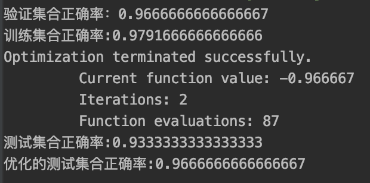

# Support Vector Machine

## SVM简介

支持向量机（support vector machines, SVM）是一种二分类模型，它的基本模型是定义在特征空间上的**间隔最大的线性分类器**，因为其源于线性的模型,因此也尝尝会被人拿去同LR模型进行比较.本篇文章旨在梳理和介绍SVM的基本原理和推导公式,帮助大家更好的了解SVM.

## SVM原理

### 函数间隔

在介绍SVM之前,我们先引入==函数间隔==的概念.对于给定的数据集 ![[公式]](https://www.zhihu.com/equation?tex=+T+) 和超平面 ![[公式]](https://www.zhihu.com/equation?tex=w%5Ccdot+x%2Bb%3D0) ，定义超平面关于样本点 ![[公式]](https://www.zhihu.com/equation?tex=+%5Cleft%28+x_i%2Cy_i+%5Cright%29+) 的函数间隔为:


函数间隔其实就是类别标签乘上了f(x)的值，该值可以表示数据点到超平面的距离.这又是为什么呢? 不妨这样想，假设y=1,f(x)=1,其实就是将原来的分类超平面f(x) 向右平移了1个单位，而y=1,f(x)=2是将原来的分类超平面f(x) 向右平移了2个单位，所以f(x)值越大的点到分类超平面的距离当然越远，这就解释了我们之前提出的问题。下图是对应某数据集在分类平面下的函数间隔.


### 几何间隔

但是函数间隔存在一定的问题，上述定义的函数间隔虽然可以表示分类预测的正确性和确信度，但在选择分类 超平面时，只有函数间隔还远远不够，因为如果成比例的改变 w 和 b，如将他们改变为 2w 和 2b，虽然此时超 平面没有改变，但函数间隔的值 yf (x) 却变成了原来的 4 倍。因此我们对应的引入了==几何间隔==,隔绝了这种因为权值变化而改变分类平面的情况.


### SVM基本的建模思路

那么如今衡量各数据点到平面的距离公式有了,我们就可以说一说SVM是如何对分类模型进行建模的了.他的假设是这样的,假设我们有一个可以变化的w和一个可以变化的b,那么可以用他们组合一个平面![[公式]](https://www.zhihu.com/equation?tex=w%5Ccdot+x%2Bb%3D0)那么显而易见的,只要找到所有点对应函数间隔最小的w和b,我们就找到了一个可以最好分割开这些数据点的超平面了,借助于这个超平面,我们就可以对任意的数据进行分类,从而达到分类的效果.具体如图所示:


因此我们就可以得到如下的约束优化函数:

![[公式]](https://www.zhihu.com/equation?tex=+%5Cunderset%7B%5Cboldsymbol%7Bw%2C%7Db%7D%7B%5Cmax%7D%5C+%5Cgamma+)

![[公式]](https://www.zhihu.com/equation?tex=+s.t.%5C+%5C+%5C+y_i%5Cleft%28+%5Cfrac%7B%5Cboldsymbol%7Bw%7D%7D%7B%5ClVert+%5Cboldsymbol%7Bw%7D+%5CrVert%7D%5Ccdot+%5Cboldsymbol%7Bx%7D_%7B%5Cboldsymbol%7Bi%7D%7D%2B%5Cfrac%7Bb%7D%7B%5ClVert+%5Cboldsymbol%7Bw%7D+%5CrVert%7D+%5Cright%29+%5Cge+%5Cgamma+%5C+%2Ci%3D1%2C2%2C...%2CN+)

借助于几何间隔和函数间隔的关系,并令几何间隔等于1后我们就可以简化得到下面的式子:

![[公式]](https://www.zhihu.com/equation?tex=+%5Cunderset%7B%5Cboldsymbol%7Bw%2C%7Db%7D%7B%5Cmin%7D%5C+%5Cfrac%7B1%7D%7B2%7D%5ClVert+%5Cboldsymbol%7Bw%7D+%5CrVert+%5E2+)

![[公式]](https://www.zhihu.com/equation?tex=+s.t.%5C+%5C+y_i%5Cleft%28+%5Cboldsymbol%7Bw%7D%5Ccdot+%5Cboldsymbol%7Bx%7D_%7B%5Cboldsymbol%7Bi%7D%7D%2Bb+%5Cright%29+%5Cge+1%2C%5C+i%3D1%2C2%2C...%2CN+)

而求解带约束的最小化的式子,我们可以通过==拉格朗日乘子法==的方式进行解决.因此原式化做如下：

![[公式]](https://www.zhihu.com/equation?tex=L%5Cleft%28+%5Cboldsymbol%7Bw%2C%7Db%2C%5Cboldsymbol%7B%5Calpha+%7D+%5Cright%29+%3D%5Cfrac%7B1%7D%7B2%7D%5ClVert+%5Cboldsymbol%7Bw%7D+%5CrVert+%5E2-%5Csum_%7Bi%3D1%7D%5EN%7B%5Calpha+_i%5Cleft%28+y_i%5Cleft%28+%5Cboldsymbol%7Bw%7D%5Ccdot+%5Cboldsymbol%7Bx%7D_%7B%5Cboldsymbol%7Bi%7D%7D%2Bb+%5Cright%29+-1+%5Cright%29%7D+)

![[公式]](https://www.zhihu.com/equation?tex=+%5Ctheta+%5Cleft%28+%5Cboldsymbol%7Bw%7D+%5Cright%29+%3D%5Cunderset%7B%5Calpha+_%7B_i%7D%5Cge+0%7D%7B%5Cmax%7D%5C+L%5Cleft%28+%5Cboldsymbol%7Bw%2C%7Db%2C%5Cboldsymbol%7B%5Calpha+%7D+%5Cright%29+)

这里的a是我们的拉格朗日乘子,又有原约束函数等于:

![[公式]](https://www.zhihu.com/equation?tex=+%5Cunderset%7B%5Cboldsymbol%7Bw%2C%7Db%7D%7B%5Cmin%7D%5C+%5Ctheta+%5Cleft%28+%5Cboldsymbol%7Bw%7D+%5Cright%29+%3D%5Cunderset%7B%5Cboldsymbol%7Bw%2C%7Db%7D%7B%5Cmin%7D%5Cunderset%7B%5Calpha+_i%5Cge+0%7D%7B%5Cmax%7D%5C+L%5Cleft%28+%5Cboldsymbol%7Bw%2C%7Db%2C%5Cboldsymbol%7B%5Calpha+%7D+%5Cright%29+%3Dp%5E%2A+)

这里要借助拉格朗日函数的对偶性将式子转换成如下(其实就是大于小于号互换)：

![[公式]](https://www.zhihu.com/equation?tex=+%5Cunderset%7B%5Calpha+_i%5Cge+0%7D%7B%5Cmax%7D%5Cunderset%7B%5Cboldsymbol%7Bw%2C%7Db%7D%7B%5Cmin%7D%5C+L%5Cleft%28+%5Cboldsymbol%7Bw%2C%7Db%2C%5Cboldsymbol%7B%5Calpha+%7D+%5Cright%29+%3Dd%5E%2A+)

接着对上述函数求w和b的偏导数.得到:

![[公式]](https://www.zhihu.com/equation?tex=%5Cboldsymbol%7Bw%7D%3D%5Csum_%7Bi%3D1%7D%5EN%7B%5Calpha+_iy_i%5Cboldsymbol%7Bx%7D_%7B%5Cboldsymbol%7Bi%7D%7D%7D+)

![[公式]](https://www.zhihu.com/equation?tex=%5Csum_%7Bi%3D1%7D%5EN%7B%5Calpha+_iy_i%7D%3D0+)

带回到原函数中简化得到:

![[公式]](https://www.zhihu.com/equation?tex=%5Cunderset%7B%5Cboldsymbol%7Bw%2C%7Db%7D%7B%5Cmin%7D%5C+L%5Cleft%28+%5Cboldsymbol%7Bw%2C%7Db%2C%5Cboldsymbol%7B%5Calpha+%7D+%5Cright%29+%3D-%5Cfrac%7B1%7D%7B2%7D%5Csum_%7Bi%3D1%7D%5EN%7B%5Csum_%7Bj%3D1%7D%5EN%7B%5Calpha+_i%5Calpha+_jy_iy_j%5Cleft%28+%5Cboldsymbol%7Bx%7D_%7B%5Cboldsymbol%7Bi%7D%7D%5Ccdot+%5Cboldsymbol%7Bx%7D_%7B%5Cboldsymbol%7Bj%7D%7D+%5Cright%29%7D%7D%2B%5Csum_%7Bi%3D1%7D%5EN%7B%5Calpha+_i%7D+)

把目标式子加一个负号，将求解极大转换为求解极小:

![[公式]](https://www.zhihu.com/equation?tex=+%5Cunderset%7B%5Cboldsymbol%7B%5Calpha+%7D%7D%7B%5Cmin%7D%5C+%5Cfrac%7B1%7D%7B2%7D%5Csum_%7Bi%3D1%7D%5EN%7B%5Csum_%7Bj%3D1%7D%5EN%7B%5Calpha+_i%5Calpha+_jy_iy_j%5Cleft%28+%5Cboldsymbol%7Bx%7D_%7B%5Cboldsymbol%7Bi%7D%7D%5Ccdot+%5Cboldsymbol%7Bx%7D_%7B%5Cboldsymbol%7Bj%7D%7D+%5Cright%29%7D%7D-%5Csum_%7Bi%3D1%7D%5EN%7B%5Calpha+_i%7D+)

![[公式]](https://www.zhihu.com/equation?tex=+s.t.%5C+%5C+%5C+%5C+%5Csum_%7Bi%3D1%7D%5EN%7B%5Calpha+_iy_i%7D%3D0+)

![[公式]](https://www.zhihu.com/equation?tex=%5C+%5C+%5C+%5C+%5C+%5C+%5C+%5Calpha+_i%5Cge+0%2C%5C+i%3D1%2C2%2C...%2CN+)

现在我们的优化问题变成了如上的形式。对于这个问题，我们有更高效的优化算法，即序列最小优化（SMO）算法。这里暂时不展开关于使用SMO算法求解以上优化问题的细节，下一篇文章再加以详细推导。

我们通过这个优化算法能得到 ![[公式]](https://www.zhihu.com/equation?tex=%5Cboldsymbol%7B%5Calpha+%7D%5E%2A+) ，再根据 ![[公式]](https://www.zhihu.com/equation?tex=%5Cboldsymbol%7B%5Calpha+%7D%5E%2A+) ，我们就可以求解出 ![[公式]](https://www.zhihu.com/equation?tex=+%5Cboldsymbol%7Bw%7D) 和 ![[公式]](https://www.zhihu.com/equation?tex=+b+) ，进而求得我们最初的目的：找到超平面，即”决策平面”。至此硬间隔的SVM其实就算是讲解完了.


### 软间隔

对于一些数据点没法用具体的某一个超平面来表示的情况,初始的SVM是无能为力的.


因此引入了==软间隔==的概念,通过对损失函数加上一个值来允许支持向量机犯“一定程度上”的错误,从而使得分类效果可靠.具体的优化函数就可以写成如下.


%5Cgeq1-%5Cxi_i,%5C%5C%5Cxi_i%5Cgeq0,%5C,%5C,%5C%5CC%3E0,i=1,2,...N)

类似的用上述的方式对软间隔的SVM进行求导就可以得到对应的优化后的参数.从而使得SVM能够对一定程度上的非线形点进行较好的分类.


### 核函数

我们看到之前的SVM一般只适于线性的情况,那么要是非线形的情况呢?这里我们就可以考虑把原有的xi和xj的内积转换成对应的==核函数==,具体地， ![[公式]](https://www.zhihu.com/equation?tex=+K%5Cleft%28+x%2Cz+%5Cright%29+) 是一个函数，或正定核，意味着存在一个从输入空间到特征空间的映射 ![[公式]](https://www.zhihu.com/equation?tex=+%5Cphi+%5Cleft%28+x+%5Cright%29+) ，对任意输入空间中的 ![[公式]](https://www.zhihu.com/equation?tex=+x%2Cz+) ，有

![[公式]](https://www.zhihu.com/equation?tex=K%5Cleft%28+x%2Cz+%5Cright%29+%3D%5Cphi+%5Cleft%28+x+%5Cright%29+%5Ccdot+%5Cphi+%5Cleft%28+z+%5Cright%29)

在线性支持向量机学习的对偶问题中，用核函数 ![[公式]](https://www.zhihu.com/equation?tex=+K%5Cleft%28+x%2Cz+%5Cright%29+) 替代内积，求解得到的就是非线性支持向量机.

![[公式]](https://www.zhihu.com/equation?tex=f%5Cleft%28+x+%5Cright%29+%3Dsign%5Cleft%28+%5Csum_%7Bi%3D1%7D%5EN%7B%5Calpha+_%7Bi%7D%5E%7B%2A%7Dy_iK%5Cleft%28+x%2Cx_i+%5Cright%29+%2Bb%5E%2A%7D+%5Cright%29+)

引入核函数很大程度上改善了SVM高维度时的分类结果.


## 代码实战

我们采用了Iris数据集来测试SVM算法.

步骤大致是对数据进行读入,holdout划分数据集成,同时采用五折交叉验证.模型采用sklearn进行搭建.

新颖的是我们采用了fmin_powell优化方法来提升SVM的分类概率的配比,大致能提升3%,在比赛的时候绝对是提分的神器.

```python
from scipy.optimize import optimize
from sklearn import svm
import pandas as pd
import numpy as np
from sklearn.metrics import accuracy_score
from sklearn.model_selection import KFold, train_test_split
from sklearn.preprocessing import LabelEncoder
import warnings
warnings.filterwarnings('ignore')

if __name__ == '__main__':
    dataset = pd.read_csv('/Users/XYJ/Documents/Alpha小组/DataSet数据集/iris.csv', index_col=0)

    data, labels = dataset.iloc[:, :-1], dataset.iloc[:, -1]
    data = np.array(data)
    ec = LabelEncoder()
    labels = ec.fit_transform(labels)
    # 数据进行划分
    traindata, testdata, trainlabels, testlabels = train_test_split(data, labels, test_size=0.2)

    model = svm.SVC(kernel='rbf', probability=True)
    train_acc, valid_acc = 0, 0
    kfold = KFold(n_splits=5, shuffle=True, random_state=2020)
    for i, (train, valid) in enumerate(kfold.split(traindata, trainlabels)):
        model.fit(traindata[train], trainlabels[train])
        valid_pre = model.predict(traindata[valid])
        train_pre = model.predict(traindata[train])
        valid_acc += accuracy_score(trainlabels[valid], valid_pre) / 5
        train_acc += accuracy_score(trainlabels[train], train_pre) / 5
    print("验证集合正确率：{}".format(valid_acc))
    print("训练集合正确率:{}".format(train_acc))
    test_pre = model.predict(testdata)
    test_pro = model.predict_proba(testdata)
    test_acc = accuracy_score(testlabels, test_pre)

    def fun(x):
        #np.hstack水平方向上的堆叠.
        tmp = np.hstack(
            [x[0] * test_pro[:, 0].reshape(-1, 1), x[1] * test_pro[:, 1].reshape(-1, 1), x[2] * test_pro[:, 2].reshape(-1, 1)])
        return - accuracy_score(testlabels, np.argmax(tmp, axis=1))

    #在原基础上去优化各数据间的配比.
    x0 = np.asarray((0, 0, 0))
    res = optimize.fmin_powell(fun, x0)
    optimize_result = np.argmax(test_pro * res, axis=1)
    optimize_acc = accuracy_score(testlabels, optimize_result)
    print("测试集合正确率:{}".format(test_acc))
    print("优化的测试集合正确率:{}".format(optimize_acc))
```

最后的代码结果:



## 总结

大致上回顾和介绍了SVM整体的思路和框架.通过找寻空间中的最优划分平面来使得模型的效果最好.介绍了核函数和软间隔等两种对于SVM进行优化的方法.


# 参考文献

《统计学习方法》 李航

[SVM系列第三讲--函数间隔和几何间隔](https://www.jianshu.com/p/2e3c0c583e85)

[支持向量机（SVM）——原理篇](https://zhuanlan.zhihu.com/p/31886934)

[SVM 由浅入深的尝试（四） 软间隔最大化的理解](https://www.jianshu.com/p/c4acd8c323ab)

[手撕SVM公式——硬间隔、软间隔、核技巧](https://blog.csdn.net/Dominic_S/article/details/83002153)